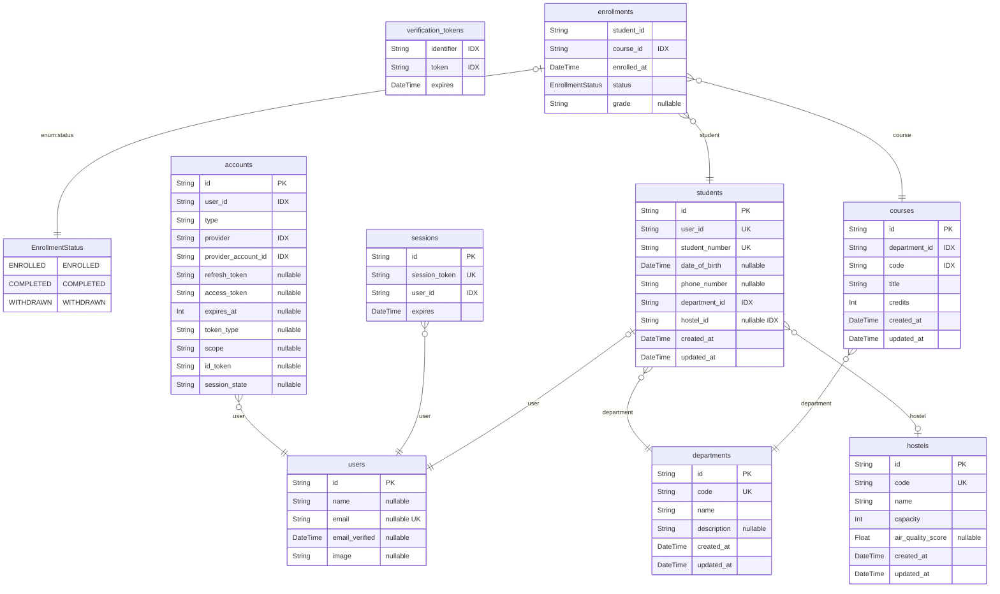

```mermaid
erDiagram

        EnrollmentStatus {
            ENROLLED ENROLLED
COMPLETED COMPLETED
WITHDRAWN WITHDRAWN
        }
    
  "users" {
    String id "PK"
    String name "nullable"
    String email "nullable UK"
    DateTime email_verified "nullable"
    String image "nullable"
    }
  

  "accounts" {
    String id "PK"
    String user_id "IDX"
    String type 
    String provider "IDX"
    String provider_account_id "IDX"
    String refresh_token "nullable"
    String access_token "nullable"
    Int expires_at "nullable"
    String token_type "nullable"
    String scope "nullable"
    String id_token "nullable"
    String session_state "nullable"
    }
  

  "sessions" {
    String id "PK"
    String session_token "UK"
    String user_id "IDX"
    DateTime expires 
    }
  

  "verification_tokens" {
    String identifier "IDX"
    String token "IDX"
    DateTime expires 
    }
  

  "students" {
    String id "PK"
    String user_id "UK"
    String student_number "UK"
    DateTime date_of_birth "nullable"
    String phone_number "nullable"
    String department_id "IDX"
    String hostel_id "nullable IDX"
    DateTime created_at 
    DateTime updated_at 
    }
  

  "hostels" {
    String id "PK"
    String code "UK"
    String name 
    Int capacity 
    Float air_quality_score "nullable"
    DateTime created_at 
    DateTime updated_at 
    }
  

  "departments" {
    String id "PK"
    String code "UK"
    String name 
    String description "nullable"
    DateTime created_at 
    DateTime updated_at 
    }
  

  "courses" {
    String id "PK"
    String department_id "IDX"
    String code "IDX"
    String title 
    Int credits 
    DateTime created_at 
    DateTime updated_at 
    }
  

  "enrollments" {
    String student_id 
    String course_id "IDX"
    DateTime enrolled_at 
    EnrollmentStatus status 
    String grade "nullable"
    }
  
    "accounts" }o--|| "users" : "user"
    "sessions" }o--|| "users" : "user"
    "students" |o--|| "users" : "user"
    "students" }o--|| "departments" : "department"
    "students" }o--|o "hostels" : "hostel"
    "courses" }o--|| "departments" : "department"
    "enrollments" |o--|| "EnrollmentStatus" : "enum:status"
    "enrollments" }o--|| "students" : "student"
    "enrollments" }o--|| "courses" : "course"
```
